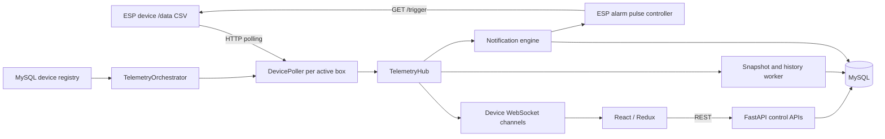

# Elevox codebase analysis

> Follow-up, 2026-09-17: firmware and KiCad files have now been supplied and reviewed in [FIRMWARE_HARDWARE_ANALYSIS.md](FIRMWARE_HARDWARE_ANALYSIS.md). The user confirmed the `firmware/Elevox` sketch is flashed. The original review below is a historical baseline; its no-firmware statements and pre-fix test/dependency/threshold observations do not describe the updated workspace.

Reviewed 2026-09-17 against the supplied project-context document.

## Scope and evidence

This is an architecture and source review of the available software, with targeted executable checks. It is not a hardware acceptance test or an exhaustive proof of correctness.

- Workspace: `/Users/debarshi/Projects/elevox`. The parent is not a Git repository.
- Backend: independent Git repository `elebox_backend`, HEAD `daed760`; 97 application Python files, approximately 8,780 lines.
- Frontend: independent Git repository `elebox_frontend`, HEAD `f86f7b1`; 152 TypeScript/TSX files, approximately 17,776 lines.
- Additional material: `telemetry_dashboard_ws 1.py`, Windows start/stop scripts, harness imagery and frontend GLB assets.
- No firmware `.ino`, KiCad schematic/PCB, or five hardware capture CSV sessions were found in the application source inventory. Hardware statements in the supplied context remain user-provided background, not locally verified facts.
- Both repository worktrees were clean before review. No application code was changed.

Product context to preserve: an Eframe connected harness monitoring system; IoT first, AI violation detection second, ML analytics third. False-safe outcomes are the primary concern. ESP32 migration, tandem sensing, a body-reference electrode, and analog-front-end changes remain proposals, not approved implementation work.

## Architecture actually present

The supplied web-stack description is substantially correct: React 19, TypeScript, Vite, MUI 6, Redux Toolkit, TanStack Query and Axios; FastAPI, SQLAlchemy 2, Pydantic 2, PyMySQL/MySQL and httpx. The UI additionally uses Three.js/React Three Fiber/Drei for the harness, Recharts for charts, and XLSX for imports/recordings.

Backend entrypoint `app/main.py` starts the telemetry subsystem through its lifespan handler. `app/tasks/telemetry_poller.py` exposes the orchestrator through a compatibility alias. API modules call services, which use repositories and SQLAlchemy models. Some services and telemetry workers query models directly, so the layering is a convention rather than a strict boundary.

The backend has APIs for authentication, roles, users, locations, work areas, boxes/assignments, monitoring/history/statistics, notifications/export/read state, alarms, battery information, and spreadsheet imports. Admin/Manager/Employee permissions are centrally defined in `app/core/rbac.py`; frontend route guards mirror the permission model.

Assignments are one box per user and one user per box, backed by database keys and service checks. Assignment/deallocation writes `box_logs`. Location/work-area consistency and duplicate user identifiers are validated. Imports support locations, work areas, users, and boxes, with row errors and partial acceptance of valid rows; import history is included in the initial SQL schema. The stale warning naming `002_import_history.sql` does not match the files supplied.

The schema is maintained as SQL scripts, not Alembic migrations. There are additional ticket/violation tables without corresponding complete application flows. MySQL timestamps are intended to be UTC. No deployment, backup, retention, HA, or CI implementation was found in the reviewed application files; `deployments` is a placeholder.

## Telemetry and safety contracts

| Concern | Implemented behavior |
|---|---|
| Device protocol | HTTP GET `/data`, parsed as CSV: hook A, hook B, battery %, voltage, buckle 1, buckle 2, buckle 3, alarm flag. An optional leading nonnumeric serial is discarded. |
| Device identity | The configured database box ID is authoritative; the optional CSV serial is not checked against it. |
| Polling | One asyncio task per active box with an IP, sharing an httpx client. Default delay: high 0.15 s, active 0.25 s, idle 1 s, failed/offline 5 s. These are sleeps in addition to request duration. |
| Scheduling | Registry refresh every 10 s; changed readings keep a device recently active for 30 s; subscriptions can request high priority. Health enum is healthy/degraded/offline/circuit_open, separate from scheduling tiers. |
| Failures | Default 1.5 s request timeout, two retries with 0.25 s delay. Five consecutive failures mark circuit_open; polling still continues at the offline interval. |
| Persistence | Three bounded queues, 10,000 entries each. Latest snapshot and last_seen written for successful readings; history sampled every 10 s. Snapshot writes run in `asyncio.to_thread`. |
| Thresholds | Independent raw hook thresholds in `box_details`; comparison is `>=`. New boxes default to 50, orchestrator substitutes 50 for null **and zero**, UI fallback is 3870. Display percentages use the separate 2500–4500 mapping. |
| Threshold updates | Database update only, picked up by registry refresh; no firmware `/config` call. Allowed range is 0–100000. |
| Automatic device alarm | Both hooks exceeded → background GET `/trigger`; per-box in-flight guard and 10 s cooldown after successful delivery. No automatic `/stop` when violation clears. |
| Manual device alarm | REST `POST /alarms/{box_id}/trigger`, protected by `alarms` permission; success/failure logged in `alarm_logs`. |
| Buckles | Backend treats exactly 1 as open. Buckle notifications are separate from the dual-hook pulse controller. |
| Browser Safety Mode | Defaults off. Enables browser audio for open buckles in known Redux devices; does not arm/disarm firmware or the backend dual-hook alarm. |
| Freshness | Backend uses persisted last_seen and a 10 s limit. Monitoring UI also applies a client-side 10 s freshness check. |

Frontend initialization restores the authenticated profile, then uses a shared reconnecting WebSocket client and subscription registry. Redux stores live telemetry, auth, notifications, dashboard and monitoring state; TanStack Query manages most REST reads/mutations. Monitoring includes device selection, thresholds, manual alarms, a 2D/3D harness with buckle calibration, trend charts, and browser recording/export. Battery “health” is a percentage-based status plus history, not a battery capacity or degradation model.

## Priority findings

These are findings/recommendations, not changes made or product decisions.

1. **High: monitoring permission also authorizes safety-threshold writes.** `app/api/sboxes.py:136` accepts `Permission.MONITORING`, granted to Employee at `app/core/rbac.py:68`. There is no per-box ownership check here. An Employee can change any box's thresholds, including raising them beyond expected readings and suppressing the backend hook trigger. Separate safety-configuration authority from read-only monitoring and define device scope explicitly. The permission mismatch was confirmed by executing the RBAC function.

2. **High: open buckle can coexist with overall “normal” status.** `src/utils/telemetryMapper.ts:58` considers online state, alarm flag, hooks and battery, but not buckles. A direct execution with buckle1=1, alarm=false, hooks below threshold and battery=80 returned `status: normal` and `buckleStatus: unsecured`. Detailed buckle indicators retain the open state, but shared summary status can mislead. Define one consistent safety-state calculation including unknown/fault states.

3. **High: malformed telemetry is not rejected consistently.** `app/utils/telemetry_parser.py:26` removes empty fields, accepts trailing fields, and does not validate binary flags or numeric ranges. A direct check accepted buckle value 2 while `is_buckle_open(2)` returned false; another accepted an empty buckle slot by shifting later fields. Preserve positions and validate the complete protocol before publishing a healthy reading. Unknown sensor values must not silently become a closed buckle. No live device was used for this check.

4. **High: WebSocket account checks differ from REST.** `app/api/websocket.py:19` verifies token/user existence and monitoring permission but omits REST's active-account check. An already issued, still-valid token can therefore establish a connection after the account is blocked. Authorization is checked only at connection time; arbitrary box IDs can be subscribed to and notifications are broadcast to all connected clients. REST monitoring is also fleet-wide. Whether that visibility is intended needs a product decision; it is not assignment-scoped today.

5. **High integration risk: documented firmware contract differs from both clients.** The supplied context describes JSON `/data` and Basic-auth `/trigger`. The production backend and standalone Python dashboard expect CSV and send no Basic-auth credentials with trigger requests. If that firmware is deployed unchanged, telemetry parsing and alarm control will fail. Verify an actual firmware build and captured response before integration claims.

6. **Reliability: a slow browser can delay server alarm processing.** `app/telemetry/hub.py:63` awaits WebSocket delivery before queuing persistence and notifications. `app/websocket/connection_manager.py:93` awaits each subscriber serially without a per-client timeout. Under backpressure, a slow client can stall the single hub worker and postpone safety events for other devices. Isolate client delivery from safety processing and define bounded dropping/coalescing policies.

7. **Scaling: process-local coordination and incomplete concurrency control.** Every application process starts its own pollers, notification state, cooldown state and WebSocket channels. Multiple Uvicorn workers would duplicate device polling/alarms without shared coordination. `TELEMETRY_MAX_CONCURRENT_POLLS` is defined but unused. Registry/offline/notification database operations still run synchronously on the event loop. Queue pressure, database latency, reconnect storms and shutdown loss require load/failure testing. No throughput claim is established by this review.

8. **Threshold semantics are inconsistent.** Raw default 50, UI fallback 3870, zero replaced by 50, firmware-context zero meaning disabled, and differing `>=` versus `>` rules are distinct behaviors. Do not silently choose one or carry an old threshold across firmware versions. There is no hysteresis/mutual-coupling classifier in the reviewed backend alarm logic.

9. **Audit history can change attribution after reassignment.** Notifications created by the engine omit `user_id`; `notification_repository.py` resolves missing users through the current `BoxAssignment`. Old incidents can consequently appear under a new wearer. Also, notification read state is global, not per reader. Store incident-time wearer/location context if historical attribution is required.

10. **User imports do not grant roles.** `ImportService.import_users` inserts User records; `ImportRepository.bulk_insert_users` only adds/flushed those records. Login rejects users without roles. A successful import is not sufficient to create a usable account until a role is assigned separately.

11. **Dashboard numbers and demo content need clear boundaries.** `src/services/index.ts:59` maps unread notifications to total violations and unread critical notifications to today's violations, without a date restriction. Dashboard charts/recent violation examples and the Reports page contain static data. Tickets call `/tickets`, for which no backend API is registered. Forgot-password submission is a no-op; profile save and most settings persistence are unfinished. The frontend refresh-token path has no corresponding backend `/auth/refresh` endpoint, and login returns only an access token.

12. **Additional networking exposure.** The device client defaults to HTTP and accepts configurable hosts/URLs without an allowlist. Device registration is privileged, but unrestricted outbound destinations remain an SSRF surface. WebSocket tokens are placed in query strings and browser tokens are stored in web storage. The standalone Python dashboard binds to all interfaces by default, accepts unauthenticated WebSocket trigger commands, performs optional subnet discovery, and swallows trigger failures. Treat it as a separate development utility, not the authenticated production backend. Neither program was started during this review.

## Reconciliation with the firmware/hardware context

No local evidence can establish the MCU pin map, GPIO16 pull resistor, ADC wiring, actual firmware credentials, OTA exposure, interrupt timing, debounce, EEPROM layout, CPU frequency, LN constant, JSON allocation behavior, or manufacturing clone resistance. The context's claims about these remain unverified. No firmware credential values were copied into this report or persistent memory.

The formula supplied in the context is dimensionally consistent: cycles divided by cycles/second gives seconds; dividing by resistance and a dimensionless logarithm gives farads; multiplying by 10^12 gives pF. With the stated constants it yields approximately 0.08929 pF/cycle. Changing LN from 1.40 to 0.89 would multiply the displayed result by about 1.573, but dimensional consistency does not validate either calibration constant.

There is also an internal interpretive conflict in the context: its conversion assigns **larger capacitance** to higher cycle counts, while prose calls high counts “less capacitance/coupling.” Coupling, leakage/conductive paths and node capacitance are not interchangeable. Resolve this using the actual schematic, measurement code and bench data rather than treating the displayed pF as calibrated physics.

The supplied 302 / 417–963 / 12020 figures describe different bridge conditions, without the raw sessions or a verified mapping to each hook's production field. A threshold between 963 and 12020 would separate those reported low/high classes arithmetically; it would not establish that the low class is a legitimate anchor rather than a hand or hook-to-hook defeat. No production safety threshold is justified from this table alone. The current software's 50 and 3870 defaults are implementation facts, not validated recommendations.

ESP32, secure manufacturing, next-generation sensing and certification questions remain open. This review does not independently validate certification or chip-security claims from the supplied notes.

## Verification and continuation

- Passed: `node node_modules/typescript/bin/tsc --noEmit --incremental false -p tsconfig.json` from the frontend repository.
- Passed: AST parsing of all 97 backend application files, the one backend test file and the standalone dashboard: 99 Python files.
- Reproduced without network/DB: open-buckle overall-normal mapper result, permissive parser cases, Employee monitoring permission.
- Frontend tests could not start: missing `@rolldown/binding-darwin-arm64`. The supplied `node_modules` contains Windows command shims.
- Backend tests were not runnable with the available system Python: pytest/pytest-asyncio/httpx/dotenv/SQLAlchemy/FastAPI are absent, and the supplied `.venv` contains Windows `Scripts` rather than a macOS interpreter. The seven existing backend tests focus on pulse/cooldown behavior; three frontend test files focus on login, guards and helpers.
- No production bundle, database integration test, browser end-to-end test, fleet load test or physical safety test was completed. Dependency directories were not replaced.

Recommended next work, if requested: establish the exact firmware wire contract; correct the safety-state/parser/threshold authorization issues; align threshold units/defaults; isolate alarm evaluation from browser/DB delays; then build reproducible macOS/deployment environments and meaningful integration/failure tests. Keep hardware design changes separate from these software fixes.
