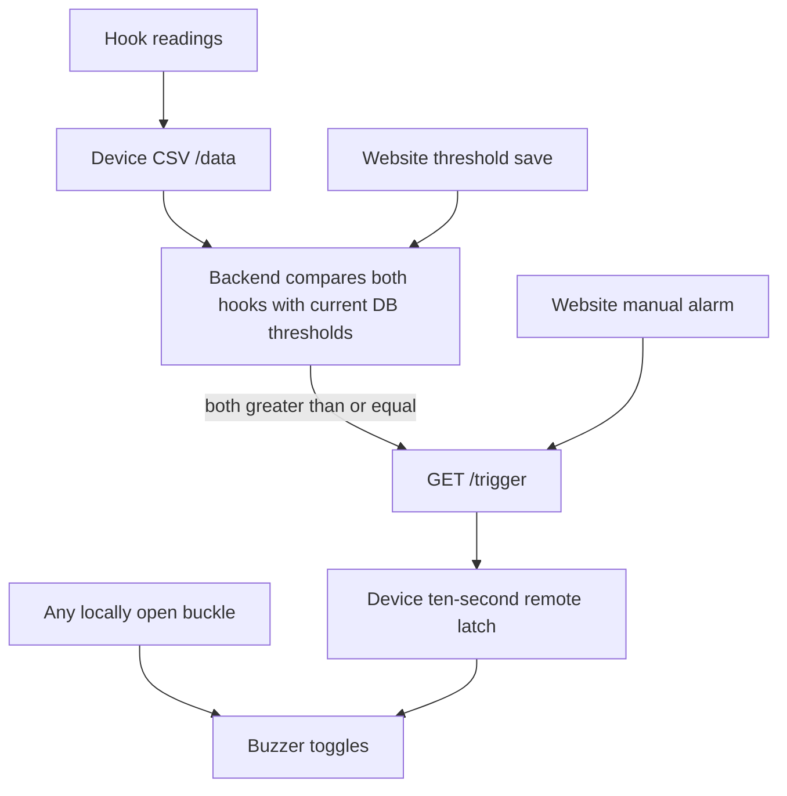

# Elevox firmware and hardware review

> Historical review before the integrated-v5 changes. See [V5_SETUP.md](docs/V5_SETUP.md) for current protocol, hotspot, threshold synchronization and build instructions.

Reviewed 2026-09-17. The user confirmed that **`firmware/Elevox/safety_harness_esp8266/safety_harness_esp8266.ino` is the firmware currently flashed**. That is the active version for this analysis; v4/v5 are alternatives, not assumed deployments.

## Scope and limitations

Read all four sketches, the Python capture utility, the KiCad schematic and project configuration. Parsed the schematic's embedded symbols, component properties, pin locations, wires and labels to reconstruct connectivity. This is source/schematic analysis, not a physical measurement or manufacturing sign-off.

- KiCad schematic: `Kicad files/Sbox_mkiii_sch_export.kicad_sch`, format version 20260306, generator 10.0; 63 placed symbols including power symbols, 138 wire segments.
- Project: `Kicad files/Sbox_mkiii_export.kicad_pro`. Project and schematic filenames have different stems.
- No `.kicad_pcb`, routed board, Gerbers, assembly drawings, harness mating-connector drawing, or captured sensor sessions were supplied. PCB clearances, antenna placement, footprints actually routed, cable wiring, and fitted component identities cannot be verified.
- No KiCad CLI or Arduino CLI was found on this Mac. No native ERC/DRC, firmware compilation, flashing, or physical alarm test was performed. Custom connectivity reconstruction is not a substitute for KiCad ERC.
- Firmware binaries/ELFs/maps exist for Elevox and v5. Both Elevox `.bin` copies are identical: 307936 bytes, SHA256 prefix `c19f2fc0cdea690b`. v5 binary is 372448 bytes, prefix `5ac1b64375fdc65c`. Supplied binaries were not proved to match the supplied source or flashed device.
- No application, firmware or schematic behavior was modified during this review. Documentation only.

## Active firmware: exact behavior

The active sketch has three endpoints: `/` (plain-text diagnostics), `/data` (CSV), and `/trigger` (unauthenticated request setting a ten-second alarm latch). It has no `/config`, `/stop`, EEPROM settings, OTA handler, autonomous hook-threshold comparison or mutual-coupling classifier.

Its `/data` contract is:

```text
id,hookA,hookB,batteryPercent,batteryVoltage,buckle1,buckle2,buckle3,remoteAlarmLatch
```

Buckle `1` means open; `0` means closed. The backend's current parser accepts this optional-ID CSV. The last field is **only the remote/manual alarm latch**, not every reason the buzzer might sound.

Each hook reading charges a GPIO for 50 microseconds, switches it to input, and measures discharge CPU cycles while driving the other hook GPIO LOW. It averages up to 16 non-timeout samples, then applies EMA alpha 0.2. All-timeout bursts produce -1. Counts are CPU cycles, not calibrated capacitance or a validated anchor classification.



Evidence: active sketch lines 12–22 (pins), 48–50 (buckle input modes), 98–117 (CSV and trigger), 123–148 (sensing), 155–157 (EMA), 168–210 (buckles and sound).

### Why it can still sound after a higher website threshold

1. **An open buckle independently sounds the device.** The condition at line 191 is `alarmActive || anyBuckleOpen`. Raising hook thresholds or turning off the website's browser Safety Mode cannot disable that local path. This is directly established by source, not proof of which condition occurred in the reported incident.
2. **A previously accepted remote pulse continues.** The ten-second latch is not cancelled by a later threshold edit. No stop endpoint exists. A manual website alarm also bypasses hook comparisons intentionally.
3. **GPIO16 may be unstable if the actual hardware matches this export.** It is plain INPUT, with no external pull-up found on that schematic net. A floating open switch input can falsely report a buckle opening. Physical wiring and any off-board pull-up must be checked before attributing the incident to this.
4. **The UI may say the device alarm is inactive while the buzzer sounds.** `/data` reports `alarmActive`, excluding `anyBuckleOpen`. This observability gap makes a local buckle alarm look like a threshold/alarm-state bug.

The active firmware cannot have an old persisted local hook threshold: there is no such setting in this sketch. The earlier website persistence and backend stale-threshold fixes address the server path; they do not alter local buckle behavior. An event capture should record all three raw buckle states, both hook values, saved DB thresholds, remote latch, and backend trigger timestamps together.

## Firmware-to-schematic pin comparison

| Function | Schematic MCU net | Active Elevox sketch | v4 / v5 |
|---|---|---|---|
| Physical LANYARD_A | GPIO4 through R9 10k | Hook B | Hook B |
| Physical LANYARD_B | GPIO5 through R10 10k | Hook A | Hook A |
| BUCKLE1 | GPIO13 | Buckle 1 | Buckle 1 |
| BUCKLE2 | GPIO14 | **Buckle 3** | Buckle 2 |
| BUCKLE3 | GPIO16 | **Buckle 2** | Buckle 3 |
| BUZZER transistor drive | GPIO12 through R13 1k | **LED_PIN, held LOW** | BUZZER_PIN |
| LED1 | GPIO2, LED wired to VCC | Unused | LED_PIN |
| LED2 | GPIO15, LED wired to GND | **BUZZER_PIN** | Unused |
| LED3 / boot switch | GPIO0 | Unused | Unused |
| SENSE / UART RX | GPIO3, R17 10k to VCC | Not sampled | Not sampled |

**The active sketch does not match the exported schematic's buzzer circuit.** It toggles GPIO15 while setting GPIO12 LOW at boot and never raising it. If the actual buzzer sounds with this sketch, the physical wiring, PCB revision, or flashed binary differs from at least one supplied artifact. This inconsistency must be resolved before choosing a pin-map fix. Swapped buckle labels and hook A/B labels also matter for UI attribution and calibration.

In v4/v5 the GPIO2 LED is driven LOW for no alarm and HIGH for an alarm, but the schematic's LED1 is active-low. That indicator would be on when idle and off during an alarm if populated as drawn.

## Schematic findings

### High priority: GPIO16 buckle has no defined open level

U3 pin 4 / GPIO16 / BUCKLE3 connects directly to J1 A6. The reconstructed net has no resistor to VCC. All firmware variants configure GPIO16 as plain INPUT; v4/v5 merely rename it buckle 3. A software debounce does not establish the electrical level of an open input. Espressif documents that RTC GPIO16 cannot use the usual internal pull-up: [GPIO reference](https://docs.espressif.com/projects/esp8266-rtos-sdk/en/release-v3.3/api-reference/peripherals/gpio.html). Verify a board/cable pull-up and actual open/closed voltages.

### High priority: battery protection current-sense connection

U2 DW01A pin 2 CS goes through R3 1k to **BATT-**. U2 pin 6 GND also connects to BATT-. The protected output ground is the separate **GNDREF** net on Q1 pins 2/3. As reconstructed, CS references the same side as the protection IC ground and cannot sense the normal voltage developed across the protection MOSFET path. Compare and correct against the selected manufacturer's application circuit before relying on overcurrent/short-circuit cutoff. This is a schematic inference; physical protection has not been tested. [DW01A manufacturer datasheet, current-sense pin and typical circuit](https://hmsemi.com/downfile/DW01A.PDF).

### High priority: Q1 symbol/footprint mismatch

Q1 FS8205A uses an **eight-pin symbol** with pins 1–8 but is assigned `Package_TO_SOT_SMD:SOT-23-6`. That footprint cannot represent all eight numbered pads of this symbol. Select the exact purchased MOSFET/package and match its symbol, footprint and pin numbers. No PCB was supplied to establish whether a routed board already corrected this.

Q2 has a related unresolved part-mapping issue: value S8050, BC547 symbol, SOT-23 footprint, and BC550-family datasheet metadata. The symbol maps 1=C, 2=B, 3=E. Verify against the actual ordered S8050 part; the name alone is not enough to establish pad compatibility.

U4 is labelled HT7833 but retains HT7333 symbol/manufacturer-part metadata. Confirm the fitted regulator, package pinout, available current and dropout from the correct datasheet rather than treating these names interchangeably.

### Battery voltage scale disagrees with the divider

R6 100k from BATT+ and R7 22k to BATT- feed the bare module ADC. Assuming the ESP8266's nominal 1.0 V ADC full scale and BATT- approximately equal to system ground during normal conduction:

```text
battery full-scale = 1.0 × (100k + 22k) / 22k = 5.545 V
firmware scale = 7.276 V
firmware / nominal schematic scale = 1.3121
real 4.20 V -> approximately 5.51 V reported
real 3.20 V -> approximately 4.20 V reported
```

Every sketch uses 7.276, so the displayed percentage could remain near 100% across much of the discharge range on this board. Measure battery and ADC voltages before calibration; do not blindly substitute a factor if the actual board differs. R7 also references raw BATT-, while MCU ADC ground is protected GNDREF, so cutoff-state behavior needs separate evaluation. [ESP8266EX ADC specification](https://documentation.espressif.com/0a-esp8266ex_datasheet_en.html).

### J1 uses a USB-C connector for custom harness signals

J1 routes CC1/CC2 to hook electrodes, A6 to BUCKLE3, B6 to charger STDBY, A7/B7 to two other buckles, SBU1 to CHRG and SBU2 to UART RX/SENSE. This is a custom signal connector, not a standard USB data interface. The separate uses of duplicate USB data positions and CC positions mean a normal USB-C cable/plug cannot be assumed to preserve all these signals independently or across reversal. No standard CC sink termination is shown. Cable pin continuity, orientation, and charging accessory compatibility require an explicit mating-harness specification. [Microchip USB-C implementation reference](https://ww1.microchip.com/downloads/aemDocuments/documents/OTH/ApplicationNotes/ApplicationNotes/00001914B.pdf).

### Boot and analog design checks still needed

- GPIO15 has a series LED/resistor path to ground, but no dedicated resistive boot pull-down was found. Confirm its reset voltage meets the required boot state; firmware pin setup happens too late to establish boot strapping. GPIO0 has R8 10k pull-up; GPIO2 is connected through LED1 to VCC. [Espressif hardware guidelines](https://documentation.espressif.com/esp8266_hardware_design_guidelines_en.html).
- Each hook electrode has 10k series resistance, 100k to GNDREF and 220pF to GNDREF. The measured node includes this intentional RC network plus electrode/cable/body effects. Neither the cycle counts nor the v4 pF conversion establish a reliable distinction between legitimate anchoring, hand contact and hooks joined together.
- No explicit electrode ESD clamp was found in the supplied schematic. Cable exposure, charge currents and input protection need board-level review.
- Charger U1 is TP4056 with R1 1.2k programming resistor; TEMP is tied to ground. Battery suitability, charge current, thermal performance and simultaneous load/charge behavior have not been validated. The schematic does not show a separate power-path controller.

## Alternative firmware variants

| Variant | `/data` | `/trigger` | Hook alarm settings | Sensing |
|---|---|---|---|---|
| Active Elevox | CSV with ID | No authentication | Backend only | 16-sample mean, EMA 0.2 |
| old_code_v1 | CSV without ID | No authentication | Backend/browser logic; no local hook threshold | Similar to Elevox |
| v4_changed | JSON | HTTP Basic authentication | One shared EEPROM threshold; 0 disables; both values strictly `>` | 24-sample median, 40000-cycle ceiling, mutual timing |
| v5_old_sense | JSON | HTTP Basic authentication | Same local threshold design as v4 | 16-sample mean, 800000-cycle ceiling, optional EMA; mutual timing |

v4/v5 also have AP+station networking, a device web UI, `/config`, HTTP firmware update and Arduino OTA. Credentials and device IDs are hardcoded; credential values are deliberately omitted here. Both variants return JSON buckle booleans meaning **true = closed**, opposite to CSV's 1 = open. The production backend expects CSV and supplies no separate device Basic-auth configuration. A protocol adapter must explicitly handle this inversion, authentication, validity and version identity before adopting these variants.

### Findings specific to v4/v5

- **Website and EEPROM thresholds are separate.** Their `/config?thresh=...` updates EEPROM, while the website updates MySQL. Example: raw 12000, DB threshold 20000, EEPROM threshold 5000 => server clear, local hook alarm active. This can explain the symptom on v4/v5, but the user confirmed these are not currently flashed.
- **Manual alarm can expire immediately due to stale time.** `now` is captured before sensing; intermediate `pump()` calls can process `/trigger` and set `alarmStartTime` later than `now`. The subsequent unsigned subtraction wraps to almost 2^32 and passes the ten-second expiry test. v4 lines 561–584; v5 lines 588–612. Refresh the timestamp after request-handling/sensing when implementing a fix.
- **v5 converts all-timeout sensing to a valid-looking zero.** `readHook()` returns `{0,0,0}` when no sample is valid (lines 183–189); zero then fails the positive local threshold test. The active sketch instead emits -1, but the backend also treats that as below threshold rather than explicitly faulty. Add a validity state end to end; do not conflate failure with secure attachment.
- **Prediction does not enforce alarm policy.** SHORTED/BODY LINK/CONTACT classification is independent from `hookViolation`. `predictOn` affects presentation, not execution of `updateState()` or the raw threshold alarm. The UI's physically strong labels exceed what can be established from hardcoded thresholds alone.
- **v5 exposes ineffective controls.** `guardFloat` is stored/reported but the sensor always drives the other hook LOW; `settleUs` and `gapMs` are saved but unused by that sensing path. In v4, `settleUs` and `guardFloat` affect measurement, but `gapMs` is unused.
- **EEPROM writes lack confirmed success reporting.** Both call `EEPROM.commit()` without checking its return and answer `ok`. There is no CRC or full field validation. v4/v5 use different magic values, so changing variants discards interpretation of previously stored settings rather than migrating them.
- **Configuration changes can race.** Device-page JavaScript fires independent `/config` fetches without checking status or serializing edits. Its threshold input initializes only once, while status text keeps updating. A stale input can therefore disagree with the live stored threshold.
- **Alarm telemetry remains incomplete.** JSON `alarm` still means the remote latch; `mode` carries the selected local cause. Buzzer disable/zero volume can suppress audible output while a non-NONE mode remains selected.
- OTA start deliberately stops sound and suspends the normal sensing/alarm loop until completion/error. Treat updates as a maintenance state, not continuous monitoring.

## Other active-firmware reliability findings

- Setup waits forever for Wi-Fi before entering `loop()`, so buckle monitoring and local alarms do not operate during a boot without network connectivity.
- Sensing masks interrupts per discharge attempt. At 80 MHz, the 800000-cycle ceiling is about 10 ms; 32 timeout attempts across both hooks approach 320 ms plus overhead. Network servicing, debounce and buzzer cadence are loop-dependent and may be delayed. CPU frequency is not pinned by a supplied build manifest.
- Timeout samples are dropped; a burst with few successful samples is reported without a valid-sample count. The backend accepts negative readings as numeric telemetry and does not raise a dedicated sensor-fault alarm.
- The buckle arrays initialize to open and debounce lasts 50 ms. A short initial alarm is possible even with closed switches while their states settle after network startup.
- No firmware version/board revision is carried in active CSV, and device identity is a hardcoded string. The backend discards that identifier rather than verifying it against the registered box. Both issues complicate diagnosing mismatched binaries and boards.

## Capture utility and legacy source

`firmware/Elevox/safety_harness_telemetry_logger.py` calls `response.json()` and expects `raw1/raw2/b1/b2/b3`, so despite its folder location it targets **v4/v5 JSON**, not the confirmed active CSV sketch. It cannot collect valid rows from active firmware unchanged. Missing JSON fields default to zero/false, which can silently label a malformed record. It stores host timestamps but no firmware version, device ID, sensor validity, mutual measurement, or threshold metadata. Its pause event is checked before HTTP acquisition, so a label change during an in-flight request can mislabel a transition sample. Use explicit session and per-hook/bridge labels for future classifier datasets.

`old_code_v1.ino` has an extra final closing brace at line 667. A lexical brace check excluding comments/strings/embedded HTML ends at -1. This is a source defect, not a compiler run. Its embedded dashboard does not make it a suitable deployment replacement.

## Checks performed and next priorities

Executed the current backend parser with representative packets: active CSV accepted; v4/v5 JSON rejected with ValueError. Executed comparisons showing an EEPROM threshold can disagree with a DB threshold, invalid -1 readings do not trip a positive server threshold, and v5 timeout zero does not trip a positive local threshold. Reproduced the v4/v5 unsigned-time arithmetic (`1000 - 1001` as uint32 = 4294967295). Parsed the logger with Python AST, checked sketch brace balance, compared binary hashes, and reconstructed schematic nets.

Recommended order:

1. Reconcile the confirmed flashed source with the physical buzzer wiring and board revision. The supplied active pin map and schematic cannot both explain a working transistor-driven buzzer as drawn.
2. Measure GPIO16 open/closed and verify its pull-up. Capture the actual alarm cause alongside server trigger timestamps.
3. Correct/verify battery-protection CS routing and Q1/Q2/U4 part mappings before manufacturing or relying on protection. Run KiCad ERC and, once the board is supplied, DRC and footprint checks.
4. Establish one versioned telemetry contract with explicit alarm cause, sensor validity, board/firmware identity and calibrated battery readings. Preserve the local buckle alarm intentionally rather than hiding it with threshold changes.
5. If adopting v4/v5, implement JSON/auth compatibility and define threshold ownership/synchronization first. Do not flash these alternatives merely because their pins better match the drawing.
6. Gather labelled, versioned bench captures before approving any body/anchor/short classifier or changing the analog design.
